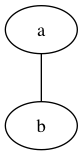
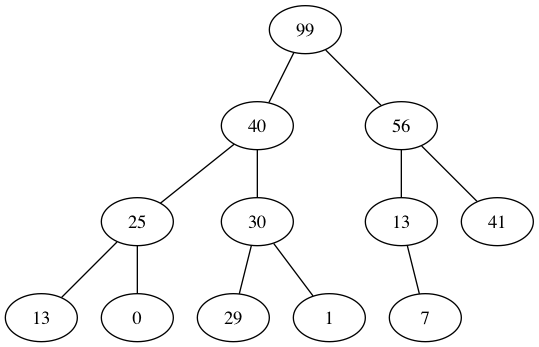

# Priority Queue

A priority queue is an abstract data type (ADT).

A PQ is like a "black blob". The PQ has a collection of items, an `insert` function and a `remove` function. Each item has an integer priority, and `remove` will remove the item with the highest priority. `insert` requires the item to insert and the priority to assign it.

Applications:
- minimum spanning tree
- shortest paths (Dijkstra)
- line segment intersection
- sorting algorithm
- event queue
- ... and many more!

PQ ADT interface:
- `Q := create_PQ()`
- `insert(Q,x,p)`
- `x := remove_max(Q)`
- `x := max(Q)`

## Binary Heap

(This is an implementation of a priority queue.)

A binary heap is a collection of tree nodes `z`. Every node has a key `z.key`, a left node `left(z)`, a right node `right(z)`, and a parent `parent(z)`. Any of these values could be `nil`. In particular, `parent(z) == nil` iff `z` is the root node.

<!--  -->

This binary heap is balanced at each level except the last, so it is "left-heavy". We want it to be balanced.

So in order to keep it balanced when inserting a node, need to find appropriate position and then swap nodes upward to make space, and then insert node. It's kind of like what happens in a linked-list. This process is `Θ(lg(n))` because the number of nodes is `2^l - 1` where `l` is the number of levels.

### Implementation as Array

Translates to array (implicit binary tree):
    
    Indecies: [1,  2,  3,  4,  5,  6,  7,  8,  9,  10, 11,12, 13 14]
    Array:    [99, 40, 56, 25, 30, 13, 41, 14, 41, 13, 0, 29, 1, 7 ]

Has useful functions:

    parent i := ⌊i/2⌋
    left   i := 2 i
    right  i := 2 i + 1

Then can implement:

    insert H k := do
        H.size = H.size + 1
        H[H.size] := k
        bubble_up H, H.size

    bubble_up H i := do
        while i > 1 and H[parent(i)] < H[i]] do
            swap H[parent[i]] H[i]
            i = parent(i)

    remove_max H := do
        k := H[1]
        H[i] = H[H.size]
        H.size = H.size - 1
        trickle_down H 1
        return k

    trickle_down H i := do
        done := False
        while !done do
            max := i
            lft := left i
            rgt := right i
            vld := is_valid H
            if vld lft and H[lft] > H[max]
                then max = lft
            if vld rgt and H[rgt] > H[max]
                then max = rgt
            if max != i
                then swap H[i] H[max]
                else done = True
            i = max

    is_valid H i := i ≤ H.size