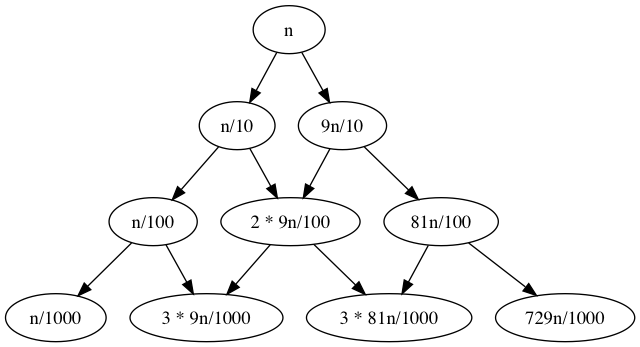
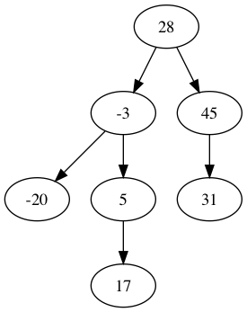

# Quicksort

    function quicksort(A,l,r) := {
        // recursive case
        if (l ≤ r) {
            p := choose_pivot(A,l,r) // pivot point
            m := partition(A,p,l,r)  // (≤ pivot) go on left, (≥ pivot) go on right
            quicksort(A,l,m-1)       // exclude pivot
            quicksort(A,l,m+1,r)     // exclude pivot
        
        // base case
        } else {
            // is sorted
        }
    }

    function partition(A,p,l,r) := {
        x := A[p]
        swap(A,r,p) // swap values at indecies r,p
        i := l      // interesting
        for (j in [l..(r-1)]) {
            if (A[j] ≤ x) {
                swap(A,j,i)
                i ++
            }
        }
        swap(A,r,i)
        return i
    }

## Runtime Analysis

Let `n := r - l + 1`. 

### Partition

In the best case, never swap anything, so linear time. In worst case, still loop same number of times but no swaps, so still linear time.

- Number of checks against pivot: `n-1`

### Quicksort

#### Best Case

Lets assume that the median is always chosen (best case). Let `C(n)` be the number of "pivot checks" in `partition` for execution of the `quicksort` on partition of size `n`. Let `n := 2^k - 1` for some natural `k`. Let `n.k = 2^k -1`.

    C(0) := 0
    C(n)
    = C(n.k)
    = 2 * C(n.(k-1)) + n.k
    = 4 * C(n.(k-2)) + 2 (n.(k-1) - 1) + (n.k - 1)
    = ...
    = 2^k C(n.0) + sum([ 2^(k-i) 2^i for i in [1..k] ]) - 2 * sum([ 2^(k-i) ])
    = (n+1) * 0 + k 2^k - 2 (1 + 2 + 4 + ... + 2^(k-2) + 2^(k-1))
    = k 2^k - 2 (2^k - 1)
    = (n+1) lg(n+1) - 2 n
    = Θ(n lg n)

#### Worst Case

Ok so thats the best case where we always choose the median, but what if we always choose the max/min? Let `M(n)` be the number of checks.

    M(0) := 0
    M(n)
    = M(n-1) + M(0) + (n-1)
    = M(n-2) + M(n-2) + (n-1)
    = ... (k times)
    = M(0) + sum([ i for i=[0..(n-1)] ])
    = n(n-1)/2
    = Θ(n^2)

Turns out that we can show that 

    Ω(n lg n) = # of pivot cheks = O(n^2)

For certain pivot strategies, we can say that worst case is `Ω(n^2)`

Pivot strategies:
- Always choose left
- Always choose right
- Always choose middle
- Compute median of the list, and then use that as pivot value
- "Median of three": pick median of `{ A[l], A[m], A[r] }`
- Random strategy: pick a random pivot value where each is equally likely. (not used in practice unless you want garunteed decent performance.)

Lets try something:

    R(<1) := 0
    R(≥1) := R(n/10) + R(9n/10) + n

Then

    R(n) = R(n/100) + 2 R(9n/100) + R(8/n) + (n/10 + 9n/10) + n

This yields the recurrence tree starting with

The left side will have depth `log_10 n` and the right side will have depth `log_(10/9) n`. It seems that `n log_10 n ≤ R(n) ≤ n log_(10/9) n`. So,

    R(n) = Θ(n lg n)

Lets consider providing, for sorting `A`, a pivot sequence to quicksort. Imagine choosing these at random from `A`. Let `A` contain distinct values `A.1 < A.2 < ... < A.n`.

**Question:** using this augmented quickstor, what is the probability that `A.i` is compared with `A.j`?

## Randomized Quicksort

From `A[l..r]` choose pivot `p in [l..r]` at random.

Consider a pivot tree for the selection of pivots `{ -20, -3, 5, 17, 28, 31, 45 }`

Notes:
- Every element gets picked a pivot once
- `x` is a descendant of `y` implies `x` was compared to `y`.
- `x` not a descendant of `y` iff `x` was not compared to `y`.
- depth of a node is the number of comparisons (to pivots)
- number of descendants is number of comparisons (as pivot)

### Experiment

Let `A` contain `n` distinct keys `a.1 < ... < a.n` in some order. Now run `random_sort` on that `A`. Consider the outcome of `choose(n,2)` sub-experiments. Have random variables (indicators of whether the `a.i, a.j` are compared)

    C.i.j := if a.i gets comapred with a.j
        then 1
        else 0

We are interested in the total number of comparisons:

    C = sum([ C.i.j for 1 ≤ i ≤ j ≤ n ])

So what is expected value of `C`?

    E(C) = sum([ E(C.i.j) for 1 ≤ i ≤ j ≤ n ])
         = sum([ P(C.i.j == 1) for 1 ≤ i ≤ j ≤ n ])

**Idea:** make `n x n` grid where the brightness of the `i,j` cell represents the percentage of the time that it's lit up.

- If one of the values between `a.i` and `a,j` gets chosen as a pivot, then `C.i.j` will be 0.
- If one of the values outside of between them, then there is no effect on `C.i.j`.
- If `a.i` is chosen as a pivot, then `C.i.j = 1`, and same for `a.j`.

Then

    P(C.i.j == 1) = 2 / (j - i + 1)

So

    E(C) = sum([ P(C.i.j == 1) | 1 ≤ i ≤ j ≤ n ])
         = sum([ 2/(j - i + 1) | 1 ≤ i ≤ j ≤ n ])
         = sum([ 2/(k+1) | 1 ≤ i ≤ n-1, 1 ≤ k ≤ n-i ])
         ≤ sum([ 1/(k+1) | 1 ≤ i ≤ n, 1 ≤ k ≤ n-1 ])
         ≤ 2 n sum([ 1/x | 2 ≤ x ≤ n ])
         ≤ 2n ∫(dx/x)
         = 2n ln n
         = O(n lg n)
