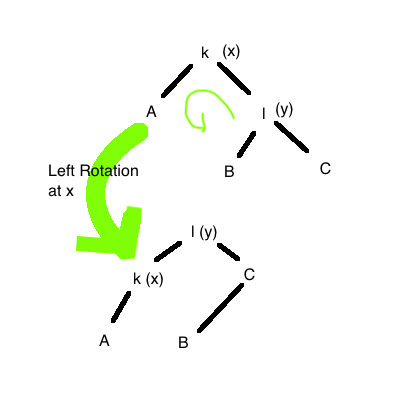
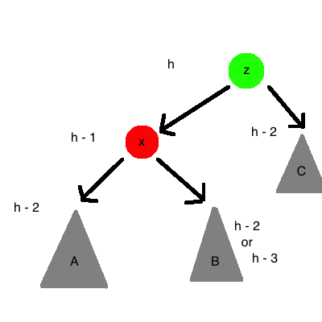
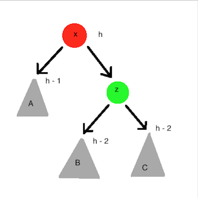

# Self-Balancing Trees (AVL Tree)

**Balance Property:**

    forall x. | height(x.left) - height(x.right) | ≤ 1

Balance trees by rotating. Example of left rotation:

The inverse would be a right rotation.

Code:

    T.left_rotation(x) :=
        p := x.parent
        y := x.right

        swap x.right with y.left
        x.parent := y

        if x.right != nil
            x.right.parent := x
        if p = nil
            T.root := y
        else if p.left = x
            p.left := y
        else if p.right = x
            p.right := y

        y.parent := p

Is constant time!

**Claim:** The height of an AVL tree is `O(lg n)`.

**Proof:** Consider the family of AVL trees with minimum number of nodes for their height.
    
    N(h) := minimum number of nodes in AVL trees of height h

Then

| **h**  | -1| 0 | 1 | 2 | 3 | 4 | 5 | 6 | 7 |
|--------|---|---|---|---|---|---|---|---|---|
|**N(h)**| 0 | 1 | 2 | 4 | 7 | 12| 20| 33| 64|

Which is following a recurrence relation that is just like the Fibbonacci numbers.

**Corollary:** `N(h) = F(n+3) - 1`

**Corollary:** `N(h) = Θ(Φ^h)`

**Theorem:** If an AVL Tree has `n` nodes and height `h` then
    
    h = O(lg n)

**Proof:**
    
    n ≥ N(h) = Ω(φ^n)

Then, if we can maintain AVL balance in the face of insertions / deletions then each AVL operation (involving search) takes `O(lg n)` time, then we get
    
    h = O(lg n)

So this will be shown below.

### AVL Tree Insertion

1. Perform a nromal BST insertio; adds a new leaf to tree
2. Walk upwards along that search path, updating the height at each node
3. Look for first node where the AVL balance property is broken. Let this node be `z`.
4.
    * case Left-Left: perform a RR@z. Balance restored at z
    * case Left-Right: perform a 
    * case Right-Left: similar!
    * case Right-Right: similar!

`C` cannot have height `h - 3`, because then `x` would be proxen wrt AVL balance. To fix `z`, can do right rotation at `z`:

## Red-Black Trees

1. Each node is either RED or BLACK (bool)
2. Root node is always BLACK
3. Leaves (nil) are considered BLACK
4. RED nodes have BLACK children
5. Every root-to-leaf path has the same number of BLACK nodes along it (BLACK height, `b`, of a node (and tree))
6. (4 & 5) => `b` ≤ `h` ≤ `2b` => `h ≤ 2 lg(n + 1)`