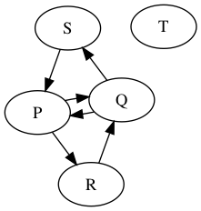
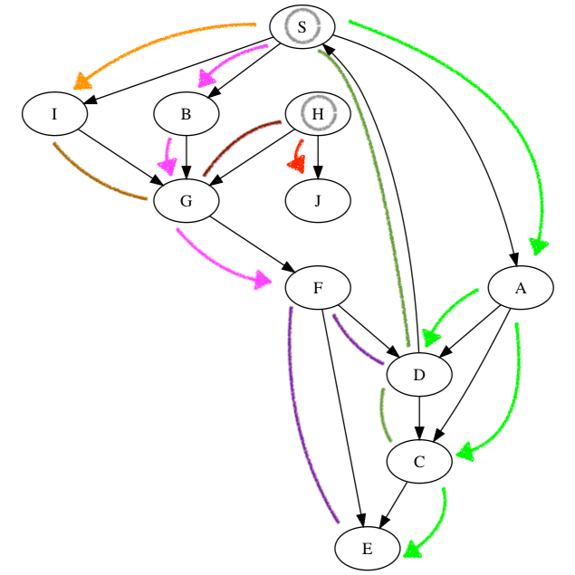

# Graphs

A **graph** `G = (V,E)` is made up of
- a collection of **nodes** (or **vertices**) `V`
- a collection of **edges** `E` where `E subset of { u,v : u in V and v in V } = V x V` is a binary relation on the nodes.

A **path** is a sequence of vertices `P = <v.0,v.1, ...,v.k>` where `vi in V` and `v.i,v.(i+1) in E`. `k` cannot be `0`. Some example paths: `<P,Q,R>, <S,P,Q,S,P,R>, <T>`.

A path is **simple** whenevre `v.0, v.1, ..., v.k` are distinct (no repeats, no cycle)

A cycle is **simple** whenever `v.1, v.2, ..., v.k` are distinct.

## An Algorithm

Interested in reachability/connectivity.

(DFS : Textbook 22.3)
(BFS : Textbook 22.2)
(Graph Representations : Textbook 22.1)

**Given:** `G = (V,E), s in V`.

**Find:** `R = { v in V | s ~> v for some path p }`, the vertices reachable from `s`. (graph traversal)

    DFS-From(u, G) :=
        if u.marked then return // already visited this node
        u.marked := true
        for v in { v in G.V | (u,v) in G.E }
            DFS-From(v, G)

    DFS-Traverse(s, G) :=
        for v in G.V do
            v.marked := false
        for v in G.V do
            DFS-From(v, G)

This would follow the paths on this graph: (first DFS-From(S), second DFS-From(H))

Could also write this to remember predecessors:

    DFS-From(u, G, p) :=
        if u.marked then return // already visited this node
        u.marked := true
        u.pred   := p
        for v in { v in G.V | (u,v) in G.E }
            DFS-From(v, G)

    DFS-Traverse(s, G) :=
        for v in G.V do
            v.marked := false
            v.pred   := ⊥
        for v in G.V do
            DFS-From(v, G, nil)

Also can do it with a counter in order to keep track of how many nodes you've visited.

### Running Time

    |G.E| = m ≤ n(n-1) = O(n^2)

    DFS-From(u, G) :=
        if u.marked then return                 // m + n
        u.marked := true                        // n
        for v in { v in G.V | (u,v) in G.E }    // n + m
            DFS-From(v, G)                      // m

    DFS-Traverse(s, G) :=
        for v in G.V do                         // n + 1
            v.marked := false                   // n
        for v in G.V do                         // n + 1
            DFS-From(v, G)                      // n

### But wat if iteration not kill?

Assume that `s.tag = none` as default.

    DFS-From(s, G) :=
        S := new Stack
        S.push(s)
        s.tag := waiting
        while S != {} do
            u := S.top()
            if u.tag = visited
            then
                S.pop()
            else
                for v in { v in G.V | (u,v) in G.E } do
                    if v.tag = none then
                        S.push(V)
                        v.tag = waiting
                    v.tag = visited