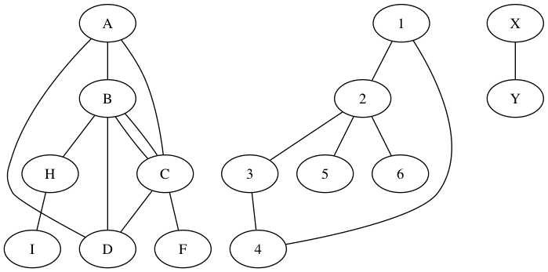

# Undirected Graphs

An undirected graph `G` has `forall (u,v) in G.E, (u,v) = (v,u)`.

Notes:
- Graph is not connected
- Has cycles
- 4 connected components

## Tree

A Graph is a tree when is has no cycles and has only one connected component (`K = 1`)

A Graph is a forest when it is the disjoint union of trees.

    |V| = n
    |E| = m
    Tree:   m = n -1
    Forest: m = n - k