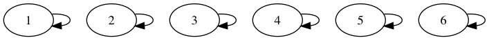
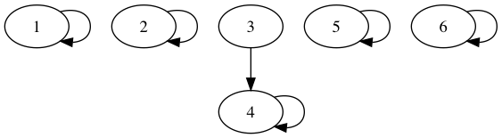

# Spanning Trees

**Spaning**: A subset `A` of `E` **spans** `G = (E,V)` when a subgraph `G_A = (V,A)` is connected.

**Spanning Tree**: A tree `T` subset of `E` is a **spanning tree** when `T` spans `G`.

Note: BFS, DFS, and Dijkstra's algorithm calculate spanning trees (not necessarily minimum spanning trees though).

## Spanning Tree Problem (MST)

    span(G) := { T subset E | T : spanning tree of G }

If `w : E -> Z` is the weight function on edges, then for `A subset E` define `w(A) := sum { w(e) | e in E }`.

### Problem Setup:

**Given:**
    
    G = (V,E)
    w : E -> Z

**Goal:**
    
    T in span(G) such that forall T' in span(G), w(T) ≤ w(T')

**Prim's-MST**(G, w)

    s := choose some element of G.V
    for v in G.V
        v.weight := ∞
        v.pred   := nil
    s.weight := 0
    H := new Min-Heap of G.V using .weight
    while H != {}
        u := H.remove-min() # lightest vertex connected to tree
        for v in G.V where (u,v) in G.E
            if v.weight > w(u,v)
                v.weight := w(u,v)
                v.pred   := u
                H.bubble-up(v)
    return { (v.pred, v) | v != s } # tree edges

**Claim:** `Prim's-MST(G, w)` is a minimum spanning tree.

To understand why this is true, check out some other more general structure of MSTs.

Let `W subset V`. This forms a cut `(W, V \ W)`. Then the **crossing edges** of this cut are `X(W) := { (u,v) in E | u in W, v in V \ W }`

**Respects a cut**: `A subset E` **respects a cut** if `A intersect X(w) = {}`.

**Light**: `X(w)` is **light** for a cut when `w(e) = min { w(e') | e' in X(w) }`.

**Find-MST**(G, w):

    F := {} # forest
    while |F| < |G.V| - 1 # while forest is not tree
        W := some cut that F respects
        e := light edge of X(w)
        F := F union {e}
    return F # will be tree

**Claim**: `Find-MST(G, w)` is a minimum spanning tree (easy to see). Then, `Prim's-MST` is an implementation of `Find-MST`, so the previous claim also follows.

**Theorem**: Let `F subset T` where `T` is a minimum spanning tree, `F` respect some cut `W`, and `e` be light for that cut. Then `F + e` is a subset of some MST.

**Proof**:

Suppose `e not in T`. Let `e in T intersect X(w)`. Consider `T' = (T = e') \ {e}`, which is also a spannng tree. Then

    w(T') = w(T) - w(e') + w(e)
    w(T') ≤ w(T) # since w(e) - w(e') ≤ 0

SO `T'` is also a minimum spanning tree.

### Kruskal

**Kruskal-MST**(G, w)

        { e.i } := sequence of the m edges sorted by non-decreasing weight
        F := {}
        Make-Sets(n) # init partitions of G.v
        for i from 1 to m
            (u,v) := e.i
            # if adding e.i doesn't create a cycle
            if Component-Find(u) = Component-Find(v) # if u,v are in different components of F # 
                F := F + e
                Component-Union(u,v) # combine the components of u,v in F
        return F # by theorem above, F is a MST

#### Runtime Analysis**

| operation | runtime                                   |
|-----------|-------------------------------------------|
| `{ e.i }:= ...`           | `Θ(m lg m)`               |
| `Make-Sets(n)`            | `Θ(n)`                    |
| `Component-Find(u or v)`  | `Θ(m(const + T.F + T.U))` |
| `T.F and T.U`             | `O(lg*n)`                 |

#### Idea #1

Keep trakc of an array `p[1...n]` (index is vertex #) where `p[i]` is the "name" of the partition containing `i`. Use `1...n` as the names of the partition. When unioning, label all the elements of smaller set of the union operation with the label of the larget set of the union operation. Is `O(n lg n)`

#### Idea #2

Union by relinking

**Component-Union**(i, j)

    x := Component-Of(i)
    y := Component-Of(j)
    p[x] := y

**Component-Find**(i)

    if p[i] = i
        return i
    else
        x := Find(p[i])
        p[i] := x # path compression
        return x

**Example**

`Component-Union(3,4)`:

This, however, could lead to really long chains.

#### Idea #3

In order to prevent ever increasing chains, keep trank of the rank of `i`:

    r[i] := height of tree that is at or below i

