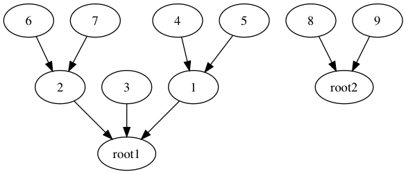
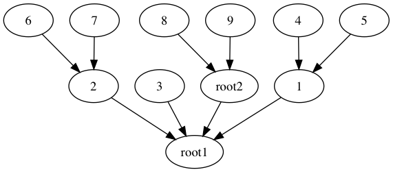

# Matroids

**Idea:** Representing a partition of `X = { 1, 2, ..., n }` as a data structure (because of Kruskal). Maintain "parent", `p`, links, one for each `i in X`. (Always combining partitions, never splitting).

Initially: `forall x in X, p[x] = x`.

Eventually get a forest, where the for each tree the root is the representative.

**Two Improvements:** 

Union trees like this, where the smaller tree always gets put into the larger one:

Before union:

After union:

So need to maintain the rank (height) of a tree for easy access.

**Psuedocode:**

    Make-Sets(n) : Nat -> () :=
        for x from 1 to n
            p[x] := x
            r[x] := 0

    Find(x) : Key -> Root Key :=
        if x != p[x]
            p[x] := Find(p[x])
        return p[x]

    Union(x,y) : (Key,Key) -> () :=
        a := Find(x)
        b := Find(y)
        if r[a] > r[b]
            p[b] := a
        else
            p[a] := b
            if r[a] = r[b]
                r[b] := r[b] + 1

**Theorem.** With `Make-Sets(n)` followed by `m` `Union/Find` operations, the total time is

    O(n + mα(n))

where `α` is the inverse Ackerman function.

**Note:** `α(n) = o(lg*n)`

**Notes:**

- Using `Union/Find` to manage components (partitions of vertices) while building forest F that spans the graph.

- If two endpoints of an edge are in different components...

- Spanning tree structure is an example of a **matroid**.

**Def.** A **matroid** `M = (S,I)` where `S` is a finite set (the matroid's elements), and `I subset P(S)` are the **independent subsets** of the matroid, where `P(S)` is the power set of `S` (nonempty). 

**Properties of Matroids:**

1. Hereditary. If `B in I` AND `A subset B`, then `A in I`.
2. Exchange. If `A, B in I` and `|A| < |B|`, then `exists x in B \ A` where `A + x in I`.

**Example:** Graphic matroid `M = (S,I)` where `S` is the set `E` of an undirected `G = (V,E)` and `I` is the family of forests (acyclic subsets).