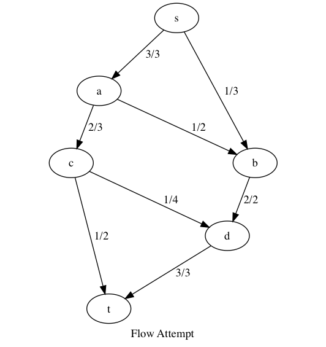

# Network Flows

Consider a directed graph `G = (V,E)` and distinguished `s,y in V, s != t`. Furthermode, if `(u,v) in E` then `v != s, u != t` where
- `s` is a **source vertex** (only has outgoing edges)
- `t` is the **sink vertex** (only has incoming edges)

Consider the transport of some commodity from `s` to `t`, through network, with delivery restricted over edges. Each edge `e` has a capacity `c(e)` where `c :E->Z+`.

1. Capacity: `0 ≤ f(e) ≤ c(e)`
2. Conservation: `sum{ f(u,v) for u in V } = sum{ f(v,w) for w in V } for all v in V \ {s,t}`

| First attempt: Flow value = 4 | Optimal: Flow value = 5   |
| ---                           | ---                       |
|  | |

where each edge is labeled with `flow / capacity`.

## Max Flow Problem

Find flow `f` that maximizes `val(f)`.

**Def.** `val(f) = sum{ f(s,v) for v in V }`

**Def.** An `s-t` cut is a partition of the vertices into sets `S,T` where `s in S, t in T`.

**Def.** Net flow across a cut

    f(S,T) := sum{ f(u,v) for u in S, v in T, (u,v) in E } // forw flow
            - sum{ f(v,u) for u in T, v in S, (u,v) in E } // back flow

**Thm.** `f(S,T) = f( {s} , V-{s} ) = val(f)`

**Prf.** (sketch)

Order vertices
    
    s = v.1, v.2, ... v.i, v.(i+1), ..., v.n = t
        where
            v.(1..i)   are in S
            v.(i+1..n) are in T
    
    val(f) = f({v.1},{v.2, ..., v.n})
           = f({v.1, v.2},{v.3, ..., v.n}) // since conservation property
           = ... (induction)
           = f(S,T)

**Thm.** For any `f` snf any `(S,T)`, `val(f) ≤ c(S,T)`.

**Thm.** `max{ val(f) for each possible flow f } = min{ c(S,T) for each possible (S,T) }`. The `min{ c(S,T) }` is the 'bottleneck'.

**Prf.** To seek an algorithm lets consider, for any valid flow f, the **residual graph** `G.f` which shows us where we have more opportunities for more flow of our commodity. Opportunities are either to 'back off' or 'racket up'.

`G.f = (V,E.f)` along with (labelling of `E.f`),

    f : E.f -> Z+

where `E.f` has two types of edges (i.e `E.f = E+.f union E-.f`)

**Forw edges**: `E+.f := { e in E | f(e) < c(e) }`. Let `r(e) := c(e) - f(e)`. Can 'ratchet up' these edges.
**Back edges**: `E-.f := { (v,u) | (u,v) in E and f(u,v) > 0 }`. Let `r((v,u)) = f(u,v)`. Can 'back off' these edges.

This suggests an algorithm

    f = _0
    while there is an augmenting p for f:
        increase f along that path
    return f